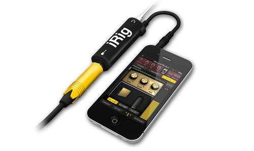

# Pincel de Som

[](https://github.com/libpd/pd-for-android)


</br>

## Concept

The 'Pincel de Som' is a experiment with the proposal to merge art, technology and music. An prototype to visual music concept. Inspired by an album of a brazilian artist Daniel Finizola with the same name ['Pincel de Som'](https://soundcloud.com/daniel-finizola).

## Design Concept

The application colors are the same colors in the chorus of the song "Sonho Cego".

* TODO:
- concept icon

## Funcionality

The app works like a guitar pedal, where the user plug an eletric musical instrument in smartphone and each color represents a guitar pedal effect. Each X-Y point of screen of each color represent a modulation of there effect.

* TODO:
- screenshot
- google play link

## Dependence

To plug an electric musical instrument in a smartphone is necessary an adapter called 'iRig'.

<p align="center">
  
  <em>illustrative picture</em>
</p>

## Libraries and tools used in the project

* [Pure Data](https://puredata.info/) - An open source visual programming language for sound synthesis.
* [pd-for-android](https://github.com/libpd/pd-for-android) - to link Pure Data code with Android.

## Structure

This project have 3 parts

### [app]

> Contains a Android code.

### [audio]

> Contains a Pure Data code.

### [scripts]

> Contains a shell script to build PD code into Android path.

## License

```
    Copyright 2018 Frank Junior
    ----------------------------------------------------------------------------
    "THE BEERWARE LICENSE" (Revision 42):
    <frankcbjunior@gmail.com> wrote this file. As long as you retain this notice you
    can do whatever you want with this stuff. If we meet some day, and you think
    this stuff is worth it, you can buy me a beer in return Frank Junior.
    ----------------------------------------------------------------------------
```


```
Copyright 2018 Frank Junior

    Licensed under the Apache License, Version 2.0 (the "License");
    you may not use this file except in compliance with the License.
    You may obtain a copy of the License at

       http://www.apache.org/licenses/LICENSE-2.0

    Unless required by applicable law or agreed to in writing, software
    distributed under the License is distributed on an "AS IS" BASIS,
    WITHOUT WARRANTIES OR CONDITIONS OF ANY KIND, either express or implied.
    See the License for the specific language governing permissions and
    limitations under the License.
```

[app]: app "App module"
[audio]: audio "Audio module"
[scripts]: scripts "Scripts module"
